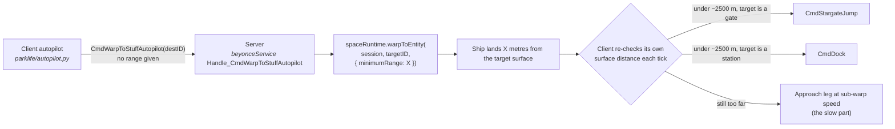

# How Autopilot Jump Zero works

> **Who this is for.** Humans who want to know what this mod actually does before
> they run it, and AI agents that have to reason about, port, or modify it later.
> Everything below is checkable against the source in this folder: file names,
> function names and the exact strings the mod matches on are all quoted, so a
> reader can jump straight to the code.

**Target:** EveJS 0.12.9 (`beyonceService.js`, build shipped with SDE 3396210)
**Mod version:** 1.1.2-beta.1 · **Manifest kind:** `loader` · **Backends:** native (Docker is registered separately, see §8)
**Runtime requirement:** Node.js 18+ (the installer needs it on `PATH` too)

---

## 0. The short version

The EveJS server decides where an autopilot warp ends, and it hardcodes that
landing point to **10,000 m** from the target. The game client only starts a
stargate jump once the ship is within about **2,500 m** of the gate, so every
autopilot hop carries an extra ~7.5 km crawl at sub-warp speed before the jump
finally fires. That crawl - not the warp itself - is what makes autopilot travel
feel slow.

This mod rewrites that one number to **0**, *in memory, while the server is
starting*. Autopilot warps then land on the target: a stargate jump goes out the
moment the warp ends, and a station destination docks on arrival.

- No file on disk is modified - not EveJS, not the mod's own copy of it.
- No game client change - **there is nothing to install on the game client**.
- One setting, and it fails closed rather than guessing (§5).

---

## 1. The problem, precisely

### 1.1 Client and server split the work

The retail client autopilot (`eve/client/script/parklife/autopilot.py`) does two
independent things:

1. **It asks for a warp with no range.** It calls
   `michelle.GetRemotePark().CmdWarpToStuffAutopilot(destinationID)` - just a
   target ID. It never says how close it wants to land, so the landing point is
   entirely the server's decision.
2. **It decides on its own when to jump or dock.** Once the *surface* distance
   from the ship to the target drops far enough, the autopilot issues its own
   `CmdStargateJump` (gate) or `CmdDock` (station). Those thresholds are client
   constants - roughly 2.5 km for both - and the server does not read them.

Because of (1), the effective autopilot range is 100% server-side. Because of
(2), the server cannot fix the pacing by making the jump range larger: the client
never asks the server whether it is allowed to jump.

### 1.2 Why raising the stargate jump range does nothing

A natural first idea is to increase the server's stargate jump range so that a
ship sitting 10 km away counts as "at the gate". That changes nothing, because
the client's jump decision does not consult any server-side range - it compares
its own surface distance against its own constant. The ship still has to close to
~2,500 m, and closing that gap is exactly the slow part.

The **warp-in distance** is therefore the only server-side lever over autopilot
travel time. This mod pulls that lever.

### 1.3 What the vanilla server does

`server/src/services/ship/beyonceService.js`, abridged (comments added):

```js
  Handle_CmdWarpToStuffAutopilot(args, session) {
    const targetID = normalizeNumber(args && args[0], 0);
    log.info(
      `[Beyonce] CmdWarpToStuffAutopilot char=${session && session.characterID} target=${targetID}`,
    );
    const activeAbyssalRun = getActiveAbyssalRunForSession(session);
    if (activeAbyssalRun) {
      // ...abyssal runs cannot warp out...
      throwAbyssalWarpBlockedError();
    }
    // <<< the seam: the warp-in distance for autopilot travel
    const result = spaceRuntime.warpToEntity(session, targetID, { minimumRange: 10000 });
    if (!result || !result.success) {
      // ...log + throw a user-facing error...
    }
    return null;
  }
```

`10000` is a literal. There is no config key, no environment variable and no
constant for it anywhere else in 0.12.9 - this call site is the whole story.

### 1.4 The consequence in game

| Leg | Vanilla 0.12.9 | With this mod (default `0`) |
|---|---|---|
| Warp to gate | warp ends 10,000 m from the gate | warp ends on the gate |
| Approach leg | ~7,500 m at sub-warp speed | none |
| Jump | after the approach leg | as the warp ends |
| Warp to station | warp ends 10,000 m out, then an approach, then dock | warp ends inside docking range, docks on arrival |

---

## 2. The change

### 2.1 The seam, before and after

Exactly one line changes, in `server/src/services/ship/beyonceService.js`:

```js
// vanilla 0.12.9
const result = spaceRuntime.warpToEntity(session, targetID, { minimumRange: 10000 });

// as seen by the running server with this mod installed (one source line)
const result = spaceRuntime.warpToEntity(session, targetID, { minimumRange: globalThis[Symbol.for("evejs.betaAutopilotJumpZero")]?.warpInDistanceMeters ?? 0 }); /* beta-autopilotJumpZero: autopilot warp-in distance */
```

That is the complete gameplay change. Nothing else in the file, and no other
file, is transformed or patched.

### 2.2 Why a `globalThis[Symbol.for(...)]` lookup instead of a literal `0`

Three reasons, all deliberate:

- **The value stays configurable at runtime** without re-transforming anything:
  the running line reads whatever the loader published at startup, so the
  distance can be retuned (§6) without touching the transform.
- **`Symbol.for("evejs.betaAutopilotJumpZero")` is a registry symbol**, so any other
  server-side code can find the mod's API without `require`-ing the mod or
  depending on its path - and the mod can be dropped into any load order.
- **`?? 0` is a fail-safe default, not an accident.** If the API is missing (for
  example someone applies this transform to a file but forgets the preload), the
  code degrades to the intended "land on the target" behaviour instead of
  silently reverting to the 10 km crawl. The mod never writes that transformed
  text to disk anyway; it only ever exists in the compiled module.

### 2.3 The marker comment

The transformed line ends with:

```js
/* beta-autopilotJumpZero: autopilot warp-in distance */
```

That marker is how the mod recognises **its own** work later (§4.2): a file that
already carries it is reported as `installed` and left alone (idempotency), and a
marker found anywhere outside the owned handler aborts the transform instead of
being silently duplicated.

---

## 3. How the mod gets loaded

The loader is a single Node module, `loader.js`, preloaded with `--require`
before the server's own entry point. Nothing is copied into the server tree and
no `require` inside EveJS is edited.

### 3.1 Step 0 - the preload

```text
# Docker (docker/entrypoint.sh, both run_server() and run_all())
    --require /app/mods/beta-autopilotJumpZero/loader.js \

# Native (StartServer.bat, inherited by both npm start branches)
# appended to the list, keeping whatever another loader mod put there
NODE_OPTIONS=<existing> --require "<root>/mods/beta-autopilotJumpZero/loader.js"

# Native, manual
node --require ../mods/beta-autopilotJumpZero/loader.js .
```

`loader.js` computes the EveJS root from its own location:

```js
const MOD_DIR = __dirname;                              // .../mods/beta-autopilotJumpZero
const RUNTIME_ROOT = path.resolve(MOD_DIR, "../..");    // the EveJS root
```

So the mod must live at `<EveJS root>/mods/beta-autopilotJumpZero/`. That is the only
installation requirement.

### 3.2 Step 1 - gates before anything is installed

`install()` runs immediately as the preload executes, and refuses in order:

| Gate | Condition | Result |
|---|---|---|
| Worker threads | `isMainThread === false` | inert, reason `worker-thread` |
| Double install | `globalThis.__betaAutopilotJumpZeroLoaderInstalled` already set | inert, reason `already-installed` |
| Disabled | `EVEJS_AUTOPILOT_JUMP_ZERO=0` | inert, logs "mod disabled", vanilla behaviour |
| Bad config | any value fails validation | **no hook installed**, each problem logged |
| Viability | the target file is not the expected shape | **no hook installed**, each failing check logged |

Every one of these is "leave the server alone", never "try anyway".

### 3.3 Step 2 - hook `Module._load`

If all gates pass, the loader wraps Node's module loader:

```js
Module._load = hookedLoad;   // previousLoad kept for pass-through and rollback
```

`hookedLoad` is intentionally cheap because it sees **every** `require()` in the
server:

1. `Module.isBuiltin(request)` → straight through (never touches `node:` internals).
2. Resolve the request with Node's own parent-aware resolver,
   `Module._resolveFilename(request, parent, isMain)`; if it throws, pass through.
3. Canonicalise the resolved filename (see §3.4) and look it up in a `Map` that
   only contains the mod's owned targets. A miss - i.e. essentially every call -
   passes straight through.
4. A hit is transformed and compiled, and the resulting `exports` are cached in
   `loadedTargets` so repeat requires are a `Map.get`.

### 3.4 Step 3 - path identity, not string matching

Matching a file by "does the path end with `beyonceService.js`" is unsafe (a
different file could share the basename, and on Windows the same file can be
spelled many ways). Instead the loader builds its target map from real filesystem
identities:

```js
const TARGETS = Object.freeze({
  beyonceService: "server/src/services/ship/beyonceService.js",
});
```

Each target is resolved against `RUNTIME_ROOT`, run through `fs.realpathSync`
(symlinks resolved), normalised and - on Windows - lower-cased with `/` folded
to `\`. Resolution results are memoised, but **only successful realpath calls are
cached**, so a path that does not exist yet can still become a match later.

### 3.5 Step 4 - transform and compile in memory

When the server eventually requires the target, the loader:

1. reads the file with `fs.readFileSync(filename, "utf8")`,
2. runs it through `transformSource()` (§4) - which throws on anything unexpected,
3. compiles the transformed text with `new Module(...)` + `compiled._compile(...)`,
4. installs it into `Module._cache[filename]` and marks it loaded.

The file on disk is never written to. If compilation throws, the cache entry is
deleted and the loader raises, so the server sees a hard failure instead of a
half-transformed module.

Two extra guards protect against ordering hazards:

- **`transforming` recursion set**: a transform that re-enters the loader for its
  own target returns the partially-built module's exports rather than recursing.
- **Pre-cached target check**: if the target module was *already* in
  `Module._cache` before the hook was installed, the loader refuses to install at
  all (`required target already cached before hook installation`). Silently
  mis-patching an already-loaded module would be worse than not installing.

### 3.6 Step 5 - publish the API

```js
globalThis[Symbol.for("evejs.betaAutopilotJumpZero")] = Object.freeze({
  version: "1.1.2-beta.1",
  warpInDistanceMeters: 0,   // the configured value
  config,                    // the full resolved config, frozen
});
```

If anything later in `install()` throws, the loader rolls back: it restores the
original `Module._load`, deletes the symbol and clears the install flag, then
logs `loader failed before activation`. A failed load can never leave a
half-installed hook behind.

---

## 4. The transform algorithm

`lib/sourceTransforms.js` owns the edit. It never uses a whole-file regex
replace; it works on an identified region and counts tokens.

### 4.1 Finding the handler scope

```js
const HANDLER_ANCHOR = "  Handle_CmdWarpToStuffAutopilot(args, session) {";
```

The anchor must appear **exactly once** in the file. From the anchor, the
transform takes everything up to the next `"\n  }"` - which is the closing brace
of that member, because members of the service object are indented by two spaces.
That gives `scope.scoped`, the only region the transform is allowed to touch.

### 4.2 The four recognised states

Inside that scope the transform counts three tokens:

| Token | Meaning |
|---|---|
| `spaceRuntime.warpToEntity(session, targetID, { minimumRange: 10000 })` | the vanilla seam |
| the rewritten line including the marker comment | the mod's own seam |
| `minimumRange: warpInDistanceMeters` | a *different* server-side patch already owns this |

and derives a state:

| State | Condition | Action |
|---|---|---|
| `vanilla` | vanilla seam ×1, installed seam ×0, marker ×0 | **replace** the seam |
| `installed` | vanilla ×0, installed ×1, marker ×1 | leave it, report `alreadyInstalled` |
| `foreign` | vanilla ×0, installed ×0, and `minimumRange: warpInDistanceMeters` present | **abort** |
| `missing` | anything else (0 or >1 of a token, marker outside the scope, no closing brace, no anchor) | **abort** |

`foreign` is what makes this mod a good citizen: a server that already carries a
hand-applied config-driven warp-in patch is detected and the mod stays inert
rather than overwriting someone else's work.

### 4.3 Invariants the transform enforces

- **Exactly one** handler anchor, **exactly one** seam, **exactly one** marker.
- The marker may not appear outside the owned scope.
- **The line count must not change** (`transformSource` compares before/after and
  fails if it does) - so an edit that accidentally swallows or duplicates a line
  is rejected even if the token counts worked out.
- Only the two-space-indented member that follows the anchor is rewritten; the
  rest of the file is copied through byte for byte.

---

## 5. Failing closed: the viability gate

Before installing any hook, `lib/viability.js` independently probes the target
file for shape - deliberately using anchors that the transform itself does not
consume, so the two checks cannot both be satisfied by the same accident:

```js
const SOURCE_REQUIREMENTS = [{
  key: "beyonceServiceShape",
  file: "server/src/services/ship/beyonceService.js",
  required: [
    "  Handle_CmdWarpToStuffAutopilot(args, session) {",
    "  Handle_CmdDock(args, session) {",
    "[Beyonce] CmdWarpToStuffAutopilot char=",
  ],
}];
```

Each token must appear exactly once. If not - wrong EveJS version, a modified or
renamed handler, a file that is not what it claims to be - the gate fails, the
mod logs `viability gate failed - no hooks installed` plus the reason, and the
server keeps running with vanilla autopilot. **The mod never guesses and never
partially applies.**

---

## 6. Configuration

Resolved by `config.js`, in this precedence order:

1. **A real environment variable** (always wins),
2. then `KEY=VALUE` lines from `.env` next to `loader.js` (supports `#` comments
   and strips matched surrounding quotes),
3. then the built-in defaults.

| Key | Default | Range / values | Effect |
|---|---|---|---|
| `EVEJS_AUTOPILOT_JUMP_ZERO` | `1` | boolean-ish (`1/true/yes/on/enabled`, `0/false/no/off/disabled`) | `0` = mod inert, vanilla behaviour |
| `EVEJS_AUTOPILOT_JUMP_ZERO_WARP_IN_METERS` | `0` | finite number, `0` .. `1000000` | autopilot warp-in distance |
| `EVEJS_AUTOPILOT_JUMP_ZERO_VERBOSE` | `0` | boolean-ish | extra hook-detail logging |

The distance is the whole tuning surface:

| Value | Behaviour |
|---|---|
| `0` | land on the target - gates jump on arrival, stations dock on arrival (**intended**) |
| `1` .. `2500` | gate landings still inside the client's ~2.5 km jump bubble |
| above `2500` | landings pushed back outside the bubble - the retail-style approach and crawl return (retail sits around `15000`) |

An out-of-range or non-numeric value is **rejected at load time**: the mod logs
the problem and goes inert. It does not clamp, and it does not guess.

**Docker note.** Images built from the EveJS project exclude dotfiles
(`.dockerignore`: `**/.env`, `**/.env.*`), so a `.env` inside the mod folder never
reaches a container. Configure Docker deployments with real environment
variables on the `server` service in `compose.yaml`:

```yaml
    environment:
      EVEJS_AUTOPILOT_JUMP_ZERO_WARP_IN_METERS: "0"
```

---

## 7. Runtime picture



`X` = `10000` in vanilla 0.12.9, `0` with this mod. The mod only moves `X`; every
arrow to its right is the game's own behaviour and is left alone.

In one sentence: *the client asks for a warp without a range, the server picks
the range, and this mod makes the server pick zero.*

---

## 8. Registration, per deployment

The mod is a preload, so it has to be registered once per launch path. The
installer (`installer/install.bat` → `installer/install.js`) covers every supported
path idempotently.

| Deployment | File | Entry added | Rebuild needed? |
|---|---|---|---|
| Docker, separate server service (Docker Compose project) | `docker/entrypoint.sh`, `run_server()` | `--require /app/mods/beta-autopilotJumpZero/loader.js` | yes - `mods/` is baked into the image |
| Docker, single-container "all" mode (the image's default `CMD ["all"]`) | `docker/entrypoint.sh`, `run_all()` | same | yes |
| Native Windows | `StartServer.bat` | `NODE_OPTIONS=<existing> --require "<root>/mods/beta-autopilotJumpZero/loader.js"` (appended) | no |
| EveJS Launcher | launcher mod list | enable the entry from `evejs-launcher.mod.json` | no |

Three deliberate implementation details, all learned the hard way:

- **`server/package.json` is not touched.** It is an input to the Docker image's
  dependency layer (`COPY server/package.json server/package-lock.json ./` +
  `npm ci`), so any byte change there forces `npm ci` to re-run on the next image
  build. Where better-sqlite3 cannot download its prebuilt binary, `npm ci`
  compiles it from source instead, and that source build aborts on Node 24 - an
  install done that way once took a live server into a `restart: always` crash
  loop. `StartServer.bat` is not in the Docker build context at all, so
  registering there cannot affect any image build.
- **`NODE_OPTIONS` needs forward slashes.** Node's `NODE_OPTIONS` parser treats
  backslashes as escapes, so `--require="C:\path\loader.js"` silently becomes
  `C:pathloader.js`. The injected block converts with
  `%EVEJS_REPO_ROOT:\=/%` while the `if exist` guard keeps native separators, and
  the block does nothing at all if the loader is not where it expects to be.
- **The block appends to `NODE_OPTIONS`; it never claims it.** `NODE_OPTIONS` is
  a list, and another loader mod may already own it, so the block writes
  `%NODE_OPTIONS% --require=...` and assigns outright only while the variable is
  still empty. The two simpler forms are both wrong: `set "NODE_OPTIONS=..."`
  drops whatever was there, and `if not defined NODE_OPTIONS set "..."` reads
  like a guard but is not one - later installs are inserted *above* earlier ones,
  so a neighbour that lands ahead of the block claims the variable first and this
  mod is then skipped without a word. v1.1.1 shipped that guard, and installing
  any other loader mod afterwards did exactly that: this mod went silent while the
  server kept running. `--require` order is hook order, and this loader replaces
  its target module instead of wrapping it, so the block also has to stay at the
  head of the preload group - innermost - where a wrapping neighbour loaded later
  still sees the exports this transform produced. Appending is what makes that
  position safe.

Uninstall is the mirror image: `installer/uninstall.bat` removes **exactly** the entries
the installer added (never a whole-file restore, so it cannot undo a mod that
registered itself later), archives the mod folder to
`<root>/_beta-autopilotjumpzero-backup/<timestamp>/`, and leaves the rest of the
checkout alone. `--keep-files` unregisters without deleting the folder.

---

## 9. What is verified

`RunTests.bat` (or `node test/run.js`) runs the mechanical suite. The development
checkout has 28 checks, all passing on Node 24, grouped as:

| Group | Covers |
|---|---|
| config (4) | defaults, environment overrides, rejection of non-numeric / out-of-range values, disabling |
| manifest + env (2) | `.env.example` only lists known keys; `evejs-launcher.mod.json` version matches the loader |
| transform (6) | the vanilla seam is rewritten in place; the transform is idempotent; fail-closed on a missing anchor, on a duplicated seam, and on a seam owned by another patch; unrelated files are left alone |
| viability (1) | a tree without the autopilot handler is rejected |
| loader guards (1) | the loader stays inert in worker threads |
| child process (2) | the installed hook actually drives the handler at `0 m` and at `15000 m` - i.e. the value really reaches `warpToEntity`, end to end |
| live tree (1) | a real EveJS checkout still reports a recognised seam state |
| installer (11) | Docker preload insertion, idempotency and removal; refusal when no launch path exists; native preload insertion, legacy upgrade, damaged-block refusal and composition with another loader mod; an end-to-end install → reinstall → uninstall round trip that leaves `server/package.json` byte-identical; and live-tree launch probes |

In game on EveJS 0.12.9, the verification run showed
`CmdWarpToStuffAutopilot` followed by `CmdStargateJump` for the same character,
with no `CmdFollowBall` or `CmdSetSpeedFraction` in between. The in-game
acceptance run also completed without issues.

---

## 10. What the mod deliberately does not do

- **It does not touch manual warps.** `Warp to`, `Warp to within`, fleet warps,
  scan-result warps, mission/agent warps, abyssal warps - every other warp call
  site carries its own explicit range and is not transformed. Only
  `Handle_CmdWarpToStuffAutopilot` is.
- **It does not change stargate jump range, aggro, or docking rules.** It only
  changes where an autopilot warp stops.
- **It does not write to disk.** No vendor file, no lock file, no generated
  source. Uninstall is removal of the registration, not a revert.
- **It does not ship or require anything on the client side.** There is nothing
  for a game client to install.
- **It does not disable itself for the faster docking.** Docking on arrival is a
  consequence of the same seam, not a separate feature.

---

## 11. Tuning, disabling, uninstalling

```text
# try the retail-style crawl again (native example)
mods\beta-autopilotJumpZero\.env ->  EVEJS_AUTOPILOT_JUMP_ZERO_WARP_IN_METERS=15000
restart the server

# turn the mod off entirely, keeping it installed
EVEJS_AUTOPILOT_JUMP_ZERO=0

# remove it
installer\uninstall.bat --server "<EveJS root>"   # then rebuild Docker, restart native
```

Docker deployments change the same keys as environment variables on the `server`
service, then `docker compose up -d --no-deps server` - no image rebuild is
needed to change a *value*, only to add or remove the *mod*.

---

## 12. Troubleshooting: reading the log

| Log line | Meaning |
|---|---|
| `[beta-autopilotJumpZero] v1.1.2-beta.1 active - autopilot warp-in distance 0 m` | installed and enabled |
| `[beta-autopilotJumpZero] in-memory transform applied: beyonceService autopilot warp-in distance 0 m` | the seam was actually rewritten in memory |
| `... in-memory transform already present:` | the file already carried the mod's own seam |
| `viability gate failed - no hooks installed` (+ reason lines) | the target file is not the shape the mod expects → **server runs vanilla** |
| `the autopilot warp-in distance is already owned by a server-side patch` | another patch owns the seam → **server runs that patch's behaviour** |
| `invalid mod-owned configuration - no hooks installed` | a config value failed validation → **server runs vanilla** |
| `inert - mod disabled; vanilla EveJS autopilot behaviour retained` | `EVEJS_AUTOPILOT_JUMP_ZERO=0` |
| `required target already cached before hook installation` | load-order problem: the server required `beyonceService` before the preload ran |
| `loader failed before activation` | the hook could not be installed; the loader rolled itself back |

In every failure case the server still starts and still runs - it just runs
vanilla autopilot. Runtime speed and correctness of the server are never traded
for the mod being present.

---

## 13. File map

```text
mods/beta-autopilotJumpZero/
  loader.js                 entry point: gates, Module._load hook, API publication
  config.js                 env/.env/default resolution + validation
  lib/sourceTransforms.js   the seam, the anchors, the state machine
  lib/viability.js          independent shape checks, fail-closed gate
  .env / .env.example       configuration file (env vars win)
  evejs-launcher.mod.json   EveJS Launcher manifest (schemaVersion 3, kind loader)
  README.md                 install / configure / verify
  HOW-IT-WORKS.md           this document
  CHANGELOG.md              what each release contains
  LICENSE                   AGPL-3.0
  test/run.js               mechanical suite
  test/installer.js         installer round-trip tests

installer/                  development only; pruned from an installed mods/ folder
  install.bat  install.js   detect the EveJS root, copy, register, back up
  uninstall.bat uninstall.js
  status.bat                report what is registered
  lib/deployment.js         root discovery, backup, copy, digests, prune lists
  lib/register.js           pure text transforms for entrypoint.sh / StartServer.bat
```

---

## 14. Invariants to keep if you modify this mod

For anyone (human or agent) extending this code:

1. **Never write the transformed source to disk.** The whole safety story rests
   on the vendor tree staying pristine; `server/package.json` byte-identity is
   asserted by a test for the same reason.
2. **Keep transformations token-counted and scoped.** No whole-file regex
   replaces, no "find the first `minimumRange`" shortcuts.
3. **Keep the line-count invariant.** A transform that changes a file's line
   count must fail, not proceed.
4. **Keep failing closed.** New failure modes must log a reason and install
   nothing, never install partially.
5. **Keep `foreign` detection.** If another patch owns the seam, stay inert.
6. **Register preloads in all server launch paths** (`run_server()`, `run_all()`,
   `StartServer.bat`) - a mod that loads in one Docker mode and not the other is
   a bug, not a simplification.
7. **Leave `server/package.json` alone.** Register in `StartServer.bat` instead.
8. **Use forward slashes in `NODE_OPTIONS`.** A backslash there is an
   escape, not a separator.
9. **Append to `NODE_OPTIONS`, never claim it.** A launcher block that assigns,
   or that guards with `if not defined`, silently disables whichever loader mod
   registers next to it.
